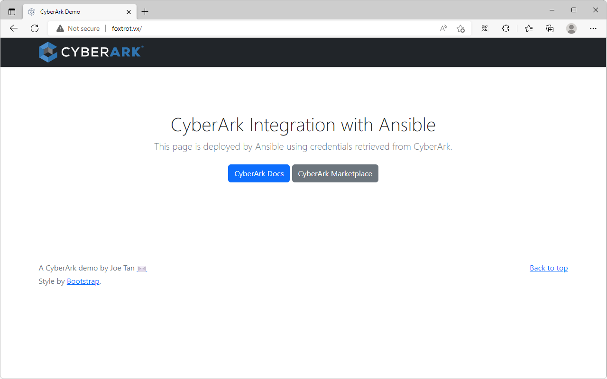

# Integrate Ansible Core with Conjur
## Introduction
- This guide demonstrates how Ansible Core can retrieve credentials from Conjur.
- The integration between Ansible and Conjur is established using the Ansible role for Conjur: <https://galaxy.ansible.com/cyberark/conjur>.
- The demonstration will retrieve the credentials from Conjur to connect to the managed node and perform a simple `ping` task.

### Software Versions
- RHEL 9.0
- Ansible Core 2.13.4
- Conjur 12.7

### Servers

| Hostname  | Role |
| --- | --- |
| conjur.vx  | Conjur master, Ansible control node  |
| foxtrot.vx  | Ansible managed node  |

# 1. Setup Conjur master
- Setup Conjur master according to this guide: <https://joetanx.github.io/conjur-master>

# 2. Install Ansible control node
```console
yum -y install python-pip
python -m pip install --user ansible
```

# 3. Setup Conjur policy
- Load the Conjur policy `ansible-vars.yaml`
  - Creates the policy `ssh_keys`
    - Creates variables `username` and `sshprvkey` to contain credentials for the Ansible managed node
    - Creates `consumers` group to authorize members of this group to access the variables
  - Creates the policy `ansible` with a same-name layer and a host `demo`
    - The Ansible control node will use the Conjur identity `host/ansible/demo` to retrieve credentials
    - Adds `ansible` layer to `consumers` group for `ssh_keys` policy
```console
curl -O https://raw.githubusercontent.com/joetanx/conjur-ansible/main/ansible-vars.yaml
conjur policy load -b root -f ansible-vars.yaml
```
- Clean-up
```console
rm -f ansible-vars.yaml
```

# 4. Prepare Ansible user on managed node
- Create user and set password to `Cyberark1`
```console
useradd ansible
echo -e "Cyberark1\nCyberark1" | (passwd ansible)
echo 'ansible ALL=(ALL) NOPASSWD: ALL' >> /etc/sudoers.d/ansible
```
- su to the ansible user
- Generate ssh key pair and set to `authorized_keys`
```console
su - ansible
mkdir ~/.ssh
ssh-keygen -t rsa -b 2048 -f ~/.ssh/id_rsa -q -N ""
cat /home/ansible/.ssh/id_rsa.pub > /home/ansible/.ssh/authorized_keys
chmod 700 .ssh
chmod 600 .ssh/authorized_keys
```
- Setup Conjur CLI, ref: <https://github.com/cyberark/conjur-api-python3/releases>
```console
curl -L -O https://github.com/cyberark/cyberark-conjur-cli/releases/download/v7.1.0/conjur-cli-rhel-8.tar.gz
tar xvf conjur-cli-rhel-8.tar.gz
mv conjur /usr/local/bin/
```
- Clean-up
```console
rm -f conjur-cli-rhel-8.tar.gz
```
-  Initialize Conjur CLI and login to conjur
```console
conjur init -u https://conjur.vx
conjur login -i admin -p CyberArk123!
```
- Set the Conjur variable value for username and SSH private key
```console
conjur variable set -i ssh_keys/username -v ansible
conjur variable set -i ssh_keys/sshprvkey -v "$(cat /home/ansible/.ssh/id_rsa && echo -e "\r")"
```

# 5. Prepare Ansible Controller
- Configure ansible inventory
- Set ControlPersist to 5s in Ansible configuration (for demo of SSH keys change, not recommended in deployment)
- Install the `cyberark.conjur` module from Ansible Galaxy
- The `cyberark.conjur` module enables variables retrieval from Conjur, ref: <https://galaxy.ansible.com/cyberark/conjur>
```console
mkdir /etc/ansible
cat << EOF >> /etc/ansible/hosts
[conjurdemo]
foxtrot.vx
EOF
cat << EOF >> /etc/ansible/ansible.cfg
[ssh_connection]
ssh_args = -o ControlMaster=auto -o ControlPersist=5s
EOF
ansible-galaxy collection install cyberark.conjur
```
- Prepare Conjur configuration file on Ansible control node
```console
openssl s_client -showcerts -connect conjur.vx:443 </dev/null 2>/dev/null | sed -ne '/-BEGIN CERTIFICATE-/,/-END CERTIFICATE-/p' > /etc/conjur-certificate.pem
cat << EOF >> /etc/conjur.conf
account: cyberark
plugins: []
appliance_url: https://conjur.vx
netrc_path: "/etc/conjur.identity"
cert_file: "/etc/conjur-certificate.pem"
EOF
cat << EOF >> /etc/conjur.identity
machine https://conjur.vx/authn
  login host/ansible/demo
  password <insert-new-api-key>
EOF
NEWAPIKEY=$(conjur host rotate-api-key -i ansible/demo | grep 'New API key' | cut -d ' ' -f 5)
sed -i "s/<insert-new-api-key>/$NEWAPIKEY/" /etc/conjur.identity
```

# 6. Run tasks to verify Ansible credential retrieval from Conjur
## 6.1. Confirm that running ad-hoc command cannot reach the managed node
- Verify that there are no credentials on the Ansible controller by running an ad-hoc command

```console
ansible conjurdemo -m ping
```
-  Expected failure output:

```console
[root@conjur ~]# ansible conjurdemo -m ping
foxtrot.vx | UNREACHABLE! => {
    "changed": false,
    "msg": "Failed to connect to the host via ssh: root@foxtrot.vx: Permission denied (publickey,gssapi-keyex,gssapi-with-mic,password).",
    "unreachable": true
}
```

## 6.2. Verify that Ansible can retrieve credentials from Conjur
- Download the helloworld Ansible playbook
- The playbook performs lookups to Conjur to retrieve the username and ssh key, then runs a single ping task

```console
curl -O https://raw.githubusercontent.com/joetanx/conjur-ansible/main/helloworld.yaml
```

- Run the demo playbook

```console
ansible-playbook helloworld.yaml
```

- Expected success:

```console
[root@conjur ~]# ansible-playbook helloworld.yaml

PLAY [conjurdemo] ***************************************************************************************************

TASK [Gathering Facts] **********************************************************************************************
ok: [foxtrot.vx]

TASK [ping] *********************************************************************************************************
ok: [foxtrot.vx]

PLAY RECAP **********************************************************************************************************
foxtrot.vx                 : ok=2    changed=0    unreachable=0    failed=0    skipped=0    rescued=0    ignored=0
```

## 6.3. Run a more complex playbook to setup the managed node as a web server
- Download the webserver Ansible playbook and the webpage template
- The playbook performs lookups to Conjur to retrieve the username and ssh key, then runs the following tasks
  - Install apache using yum
  - Allow http service on firewalld
  - Enable the httpd service to start on machine boot
  - Deploy the template `index.html.j2` as the index page
  - Restart the httpd services

```console
curl -O https://raw.githubusercontent.com/joetanx/conjur-ansible/main/webserver.yaml
curl -O https://raw.githubusercontent.com/joetanx/conjur-ansible/main/index.html.j2
```

- Run the demo playbook

```console
ansible-playbook webserver.yaml
```

- Expected result:

```console
[root@conjur ~]# ansible-playbook webserver.yaml

PLAY [conjurdemo] ****************************************************************************************************

TASK [Gathering Facts] ***********************************************************************************************
ok: [foxtrot.vx]

TASK [yum] ***********************************************************************************************************
changed: [foxtrot.vx]

TASK [firewalld] *****************************************************************************************************
changed: [foxtrot.vx]

TASK [systemd] *******************************************************************************************************
changed: [foxtrot.vx]

TASK [template] ******************************************************************************************************
changed: [foxtrot.vx]

RUNNING HANDLER [systemd] ********************************************************************************************
changed: [foxtrot.vx]

PLAY RECAP ***********************************************************************************************************
foxtrot.vx                 : ok=6    changed=5    unreachable=0    failed=0    skipped=0    rescued=0    ignored=0
```

- Browse to the managed node to verify that web server deployment is successful


